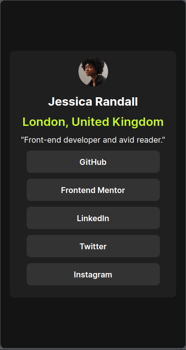

# Frontend Mentor - Social links profile solution

This is a solution to the [Social links profile challenge on Frontend Mentor](https://www.frontendmentor.io/challenges/social-links-profile-UG32l9m6dQ). Frontend Mentor challenges help you improve your coding skills by building realistic projects. 

## Table of contents

- [Overview](#overview)
  - [The challenge](#the-challenge)
  - [Screenshot](#screenshot)
  - [Links](#links)
- [My process](#my-process)
  - [Built with](#built-with)
  - [What I learned](#what-i-learned)
- [Author](#author)

## Overview

### The challenge

Users should be able to:

- See hover and focus states for all interactive elements on the page

### Screenshot

#### Desktop View

#### Mobile View

### Links

- Live Site URL: [Live site URL](https://social-links-profile-hatemhenchir.vercel.app/)

## My process

### Built with

- Semantic HTML5 markup
- CSS custom properties
- Flexbox
- Mobile-first workflow

## Author

- Website - [Hatem | Portfolio](https://hatemhenchir.vercel.app)
- Frontend Mentor - [@hatemhenchir](https://www.frontendmentor.io/profile/hatemhenchir)
- Linkedin - [@hatemhenchir](https://www.linkedin.com/in/hatem-henchir)
